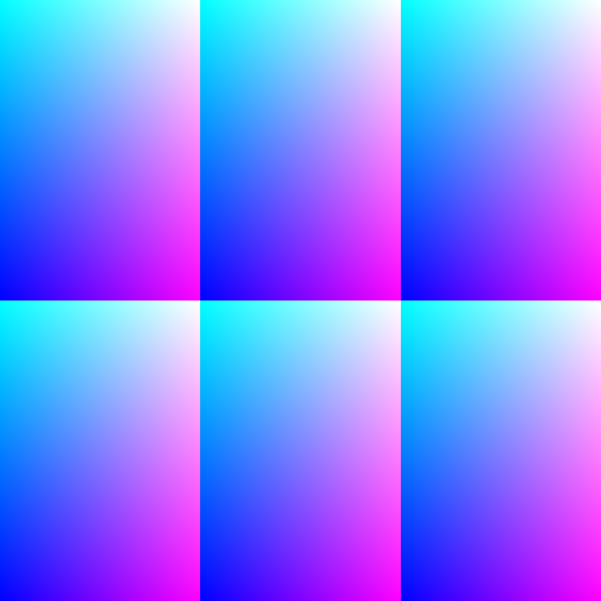

# glsl-tiling

Utility function for the tessellation of the [0, 1] plane.

## Install

```sh
npm install glsl-tiling
```

## Usage

```glsl
#pragma glslify: tiling = require(glsl-tiling)

void main() {
	vec2 p = gl_FragCoord.xy / resolution.xy;

	// t.xy is a vec2 with the new coordinates.
	// t.zw is a vec2 with the tiles i, j indexes, from 0 to the number of columns(rows) - 1.
	vec4 t = tiling(p, vec2(3., 2.)); // 3 columns and 2 rows

	gl_FragColor = vec4(t.xy, vec2(1.0));
}
```


